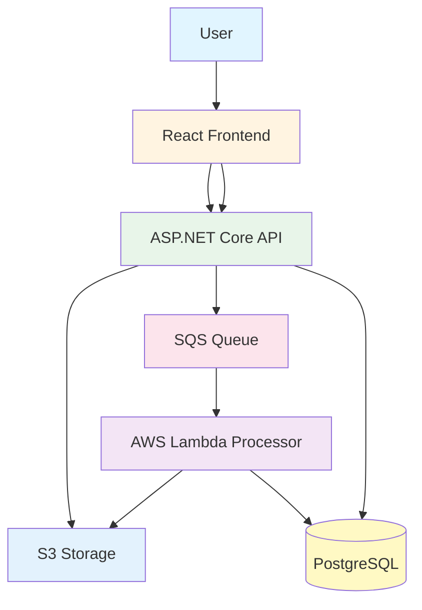
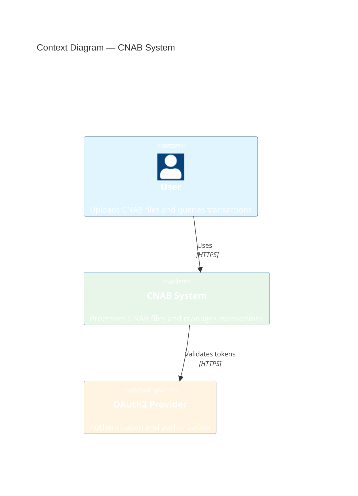
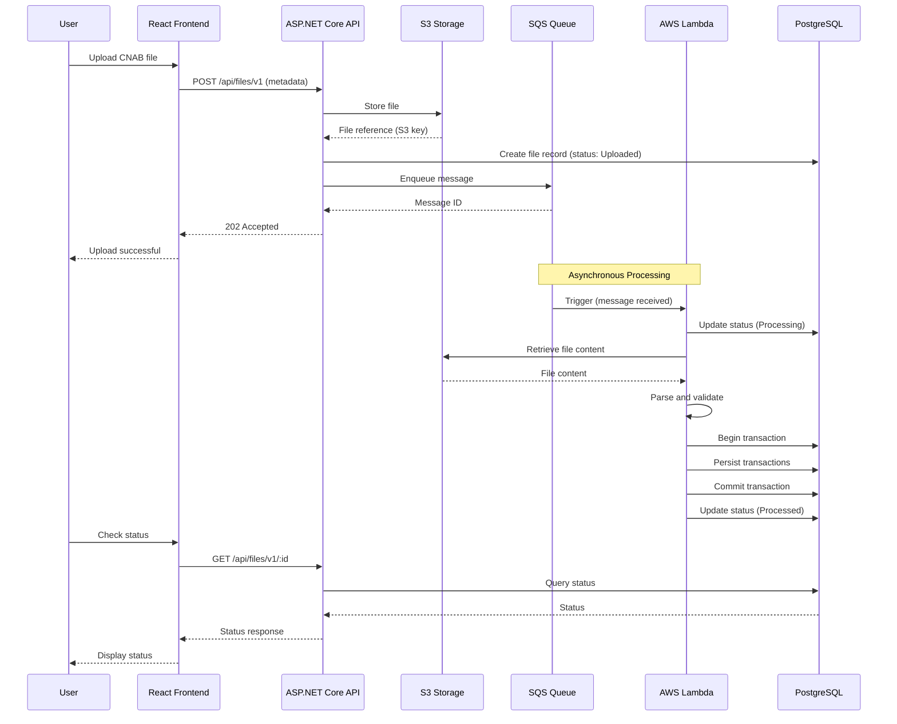
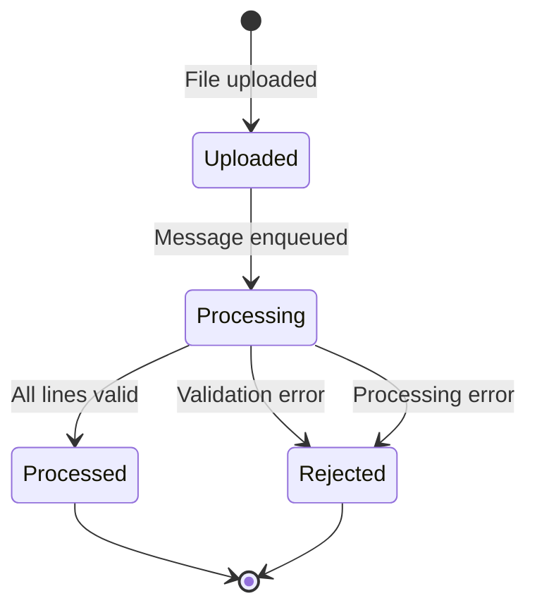

# Architecture

This document provides a high-level overview of the system architecture, components, and their interactions.

## Overview

The solution is a **cloud-native, serverless, asynchronous system** designed to process CNAB files, persist transactional data, and expose query capabilities via APIs and a web frontend.

## Architectural Principles

### Clean Architecture

The project follows Clean Architecture principles:

- **Domain** at the center — core business logic
- **Application** orchestrates use cases
- **Infrastructure** implements external concerns
- **Presentation** exposes APIs and UI

Dependencies always point **inward** — outer layers depend on inner layers, never the opposite.

### Domain-Driven Design (DDD)

- Explicit domain models
- Aggregates with invariants
- Value Objects where applicable
- Domain services for complex business rules

### Design Principles

- **SOLID** — Single Responsibility, Open/Closed, Liskov Substitution, Interface Segregation, Dependency Inversion
- **DRY** — Don't Repeat Yourself
- **KISS** — Keep It Simple, Stupid
- **YAGNI** — You Aren't Gonna Need It

## System Components

### Frontend (React)

- Web-based user interface
- File upload functionality
- Transaction listing and filtering
- Real-time status updates
- Non-blocking UX

### Backend API (ASP.NET Core)

- RESTful endpoints
- File upload handling
- Query endpoints
- Authentication (OAuth2)
- Swagger documentation

### Processing Service (AWS Lambda)

- Asynchronous file processing
- CNAB file parsing
- Validation logic
- Database persistence
- Error handling

### Message Queue (SQS)

- Decouples upload from processing
- Manages message queue depth
- Dead Letter Queue (DLQ) for failed messages

### Storage (S3)

- Large file storage
- File reference storage
- Secure file access

### Database (PostgreSQL)

- Transactional data storage
- Store information
- File processing status
- ACID compliance

## System Architecture Diagram

## Context Diagram

## Upload and Processing Flow

## Communication Between Components

### Synchronous Communication

- **Frontend ↔ API**: HTTP/REST for user interactions
- **API ↔ Database**: Direct connection for queries
- **API ↔ S3**: Direct storage operations

### Asynchronous Communication

- **API → SQS**: Message queueing for file processing
- **SQS → Lambda**: Event-driven processing
- **Lambda → Database**: Transactional operations
- **Lambda → S3**: File retrieval

## Serverless Decisions

### Why Serverless?

- **Automatic Scalability**: Lambda scales automatically based on queue depth
- **Cost Efficiency**: Pay only for what you use
- **Reduced Maintenance**: No server management
- **High Availability**: AWS-managed infrastructure

### Serverless Components

- **API Gateway + Lambda**: For API endpoints
- **Lambda Functions**: For file processing
- **SQS**: For message queueing
- **S3**: For file storage

### Benefits

- Reduced operational costs
- Automatic scalability
- High availability
- Focus on business logic

## Data Flow

### Upload Flow

1. User uploads file via frontend
2. Frontend sends metadata to API
3. API stores file in S3
4. API enqueues message in SQS
5. API returns immediately (non-blocking)

### Processing Flow

1. Lambda triggered by SQS message
2. Lambda retrieves file from S3
3. Lambda opens a database transaction
4. Lambda validates and parses the file
5. Lambda persists all transactions atomically
6. Lambda commits or rolls back the transaction
7. Lambda updates the file status

### Query Flow

1. User requests a list of transactions
2. Frontend calls API with filters
3. API queries the database
4. API returns results
5. Frontend displays data

## File State Flow

## Scalability Considerations

### Horizontal Scalability

- **Lambda**: Automatically scales based on queue depth
- **API**: Can scale horizontally behind a load balancer
- **Database**: Read replicas to scale queries

### Performance Optimization

- Asynchronous processing prevents blocking
- S3 for large file storage
- Database indexing for query performance
- Connection pooling for database access

## Security Architecture

- **OAuth2 Authentication**: LocalStack Cognito (local) / AWS Cognito (production)
- **JWT Validation**: Comprehensive validation including signature, expiration, issuer, audience
- **OWASP Compliance**: Mitigation of OWASP Top 10 and known JWT vulnerabilities
- **AWS Secrets Manager**: Centralized credential and secret management
- **Configuration-First**: No hardcoded credentials in code
- **S3 Bucket Policies**: Restricted access to files
- **Encrypted Connections**: Database with SSL/TLS
- **Input Validation**: Sanitization across layers
- **API Versioning**: URL-based suffix pattern (/api/resource/v1) for client compatibility

See [security.md](security.md) for detailed security considerations and OAuth2 implementation.

## Observability

- Structured logging across all layers
- Correlation IDs for request tracing
- Metrics collection (Prometheus)
- Distributed tracing capabilities

See [observability.md](observability.md) for detailed information.

## Deployment Architecture

### Local Development

- Docker Compose orchestrates all services
- Local PostgreSQL instance
- Local S3 emulation (if needed)
- Local SQS emulation (if needed)

### Cloud Deployment (AWS)

- API Gateway + Lambda for API
- Lambda functions for processing
- RDS PostgreSQL for database
- S3 for file storage
- SQS for message queuing
- CloudWatch for logging and metrics

## Technology Decisions

- **Serverless**: AWS Lambda for cost efficiency and auto-scaling
- **PostgreSQL**: Strong transactional support and cloud-native
- **SQS**: Managed message queuing with DLQ support
- **S3**: Scalable object storage for large files
- **Clean Architecture**: Maintainable, testable code structure

See [decisions-and-tradeoffs.md](decisions-and-tradeoffs.md) for detailed rationale.
