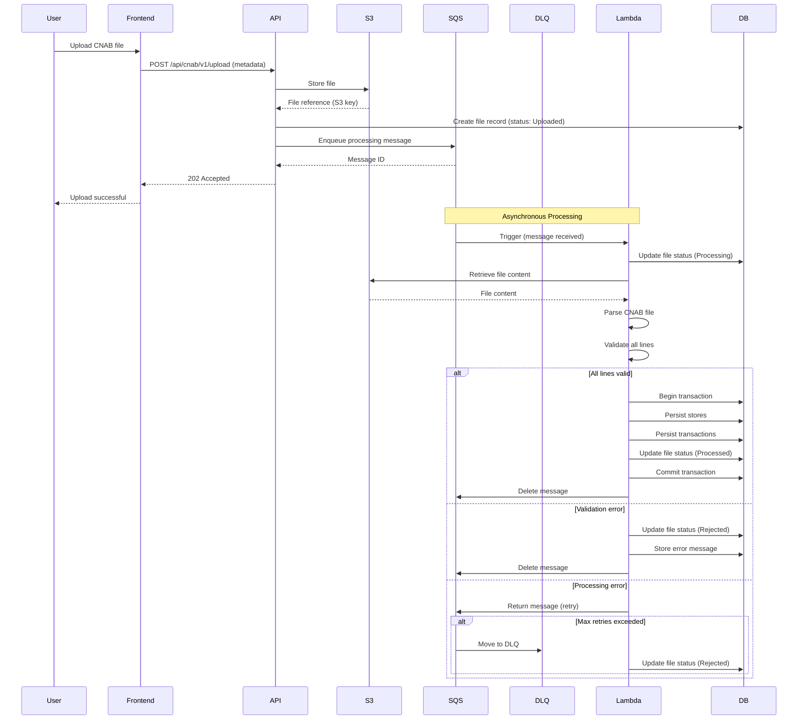

# Asynchronous Processing

This document describes the asynchronous file processing flow, message queuing, and error handling strategies.

## Overview

The system uses an **asynchronous processing pattern** to decouple file upload from file processing. This ensures:

- Non-blocking user experience
- Scalable processing
- Resilience to failures
- Ability to handle large files

## Processing Flow

### Complete Flow Diagram



## Components

### SQS (Simple Queue Service)

**Purpose**: Decouple upload from processing

- **Queue Type**: Standard Queue (or FIFO for ordering)
- **Message Format**: JSON with file reference
- **Visibility Timeout**: Configured based on processing time
- **Message Retention**: 14 days (default)

### Dead Letter Queue (DLQ)

**Purpose**: Handle poison messages and failures

- **Max Receives**: 3 attempts before moving to DLQ
- **DLQ Retention**: 14 days
- **Monitoring**: Alert on DLQ messages
- **Manual Review**: DLQ messages require investigation

### S3 (Simple Storage Service)

**Purpose**: Store large CNAB files

- **Bucket**: Dedicated bucket for CNAB files
- **Key Format**: `files/{file-id}/{timestamp}.txt`
- **Lifecycle**: Archive or delete old files
- **Access Control**: Private bucket with Lambda access

### Lambda Function

**Purpose**: Process CNAB files

- **Trigger**: SQS event source mapping
- **Concurrency**: Configurable (default: 10)
- **Timeout**: Based on file size (max 15 minutes)
- **Memory**: Based on file size requirements

## Message Format

### SQS Message

```json
{
  "fileId": "550e8400-e29b-41d4-a716-446655440000",
  "s3Key": "files/550e8400-e29b-41d4-a716-446655440000/2024-01-15T10:30:00.txt",
  "fileName": "cnab_file.txt",
  "uploadedAt": "2024-01-15T10:30:00Z"
}
```

### Message Attributes

- `fileId`: Unique file identifier
- `s3Key`: S3 object key
- `fileName`: Original file name
- `uploadedAt`: Upload timestamp

## Processing Steps

### 1. File Upload

- User uploads file via frontend
- Frontend sends metadata to API
- API validates metadata
- API stores file in S3
- API creates file record (status: Uploaded)
- API enqueues message in SQS
- API returns 202 Accepted

### 2. Message Consumption

- Lambda triggered by SQS message
- Lambda receives message with file reference
- Lambda updates file status to Processing
- Lambda retrieves file from S3

### 3. File Processing

- Lambda parses CNAB file line by line
- Lambda validates each line:
  - Line length (80 characters)
  - Field formats
  - Business rules
- If any line fails: reject entire file

### 4. Data Persistence

- Lambda opens database transaction
- Lambda creates/updates stores
- Lambda creates transactions
- Lambda commits transaction (all-or-nothing)
- Lambda updates file status to Processed

### 5. Error Handling

- On validation error: update status to Rejected
- On processing error: return message to queue (retry)
- On max retries: move to DLQ, mark as Rejected

## Idempotency

### Idempotent Processing

Processing must be idempotent to handle:

- Duplicate messages
- Retries after failures
- Lambda timeouts

### Idempotency Strategy

- **File Status Check**: If file already processed, skip
- **Transaction Check**: If transactions exist for file, skip
- **Idempotency Key**: Use file ID as idempotency key

### Implementation

```csharp
// Check if file already processed
var file = await repository.GetByIdAsync(fileId);
if (file.Status == FileStatus.Processed)
{
    // Already processed, skip
    return;
}

// Process file
// Status check ensures idempotency
```

## Retry Strategy

### Retry Logic


### Retry Scenarios

1. **Transient Errors**: Network issues, temporary DB unavailability
2. **Lambda Timeouts**: Large files exceeding timeout
3. **Throttling**: Rate limiting from S3 or database

### Retry Configuration

```yaml
# SQS Configuration
MaxReceiveCount: 3
VisibilityTimeout: 300  # 5 minutes

## Notification Delivery & Retry

**Purpose**: Ensure users are informed of processing results even when notification attempts fail.

### Flow
- After status update (Processed/Rejected), enqueue notification work.
- Notification sender uses exponential backoff with limited retries (e.g., 3 attempts).
- On persistent failure, message moves to a dedicated Notification DLQ for later retry/inspection.

### Retry Policy (example)
```csharp
MessageRetentionPeriod: 1209600  # 14 days

# Lambda Configuration
Timeout: 900  # 15 minutes
ReservedConcurrentExecutions: 10
```

## Error Handling

### DLQ Handling
- Separate Notification DLQ to isolate notification failures from file-processing failures.
- Background worker periodically retries DLQ notifications.
- CloudWatch alarm on DLQ depth > 0; manual review if retries continue failing.

### Fallback
- If notifications ultimately fail, users can still poll `GET /api/files/v1/{id}` for status.


### Error Types

1. **Validation Errors**
   - Invalid file format
   - Invalid line structure
   - Business rule violations
   - **Action**: Reject file, don't retry

2. **Processing Errors**
   - Database errors
   - Parsing errors
   - **Action**: Retry (up to max)

3. **System Errors**
   - Lambda timeout
   - Out of memory
   - **Action**: Retry (up to max), then DLQ

### Error Response

```json
{
  "fileId": "550e8400-e29b-41d4-a716-446655440000",
  "status": "Rejected",
  "error": {
    "code": "VALIDATION_ERROR",
    "message": "Line 5: Invalid transaction type",
    "lineNumber": 5
  }
}
```

## Monitoring

### Key Metrics

- **Queue Depth**: Number of messages waiting
- **Processing Duration**: Time to process file
- **Success Rate**: Percentage of successful processing
- **DLQ Depth**: Number of failed messages
- **Error Rate**: Percentage of errors

### Alerts

- High queue depth (>1000 messages)
- High DLQ depth (>10 messages)
- Low success rate (<95%)
- High error rate (>5%)

## Scalability

### Horizontal Scaling

- **Lambda**: Automatically scales based on queue depth
- **Concurrency**: Configurable concurrent executions
- **Batching**: Process multiple messages per invocation (if configured)

### Performance Optimization

- **Connection Pooling**: Reuse database connections
- **S3 Multipart**: For large files
- **Batch Processing**: Process multiple transactions in batch
- **Caching**: Cache store lookups

## Dead Letter Queue (DLQ)

### DLQ Purpose

- Handle poison messages
- Investigate processing failures
- Manual reprocessing if needed

### DLQ Monitoring

- Alert on DLQ messages
- Log DLQ message details
- Regular DLQ review
- Manual reprocessing workflow

### DLQ Message Format

```json
{
  "fileId": "550e8400-e29b-41d4-a716-446655440000",
  "s3Key": "files/550e8400-e29b-41d4-a716-446655440000/2024-01-15T10:30:00.txt",
  "error": {
    "code": "PROCESSING_ERROR",
    "message": "Database connection timeout",
    "attempts": 3
  },
  "receivedAt": "2024-01-15T10:30:00Z",
  "movedToDLQAt": "2024-01-15T10:45:00Z"
}
```

## Local Development

### Local SQS Emulation

- Use LocalStack for SQS emulation
- Or use in-memory queue for testing
- Same message format

### Local S3 Emulation

- Use LocalStack for S3 emulation
- Or use local file system
- Same API interface

### Testing Async Processing

- Unit tests for processing logic
- Integration tests with local SQS/S3
- End-to-end tests for complete flow

## Production Considerations

### AWS Services

- **SQS**: Managed queue service
- **S3**: Managed object storage
- **Lambda**: Serverless compute
- **CloudWatch**: Monitoring and logging

### Cost Optimization

- Right-size Lambda memory
- Optimize S3 storage class
- Monitor queue depth
- Archive old files

### Security

- Encrypt S3 objects
- Secure SQS access
- Lambda execution role
- VPC configuration (if needed)

## Best Practices

1. **Always validate before processing**
2. **Use transactions for data consistency**
3. **Implement idempotency**
4. **Monitor queue depth**
5. **Handle DLQ messages promptly**
6. **Log all processing steps**
7. **Use correlation IDs**
8. **Test retry scenarios**
