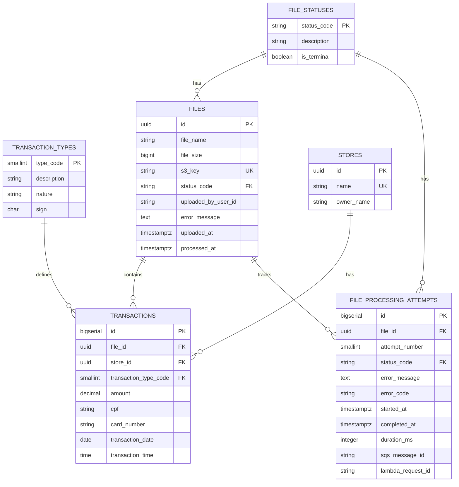

# Database

This document describes the database design, schema, and data persistence strategy.

## Database Choice

### PostgreSQL

PostgreSQL was chosen for:

- **Cloud-native friendliness**: Excellent support on AWS RDS
- **Docker compatibility**: Easy local development setup
- **Strong transactional support**: ACID compliance for file processing
- **Rich feature set**: JSON support, full-text search, extensions
- **Performance**: Excellent query performance and indexing
- **Maturity**: Battle-tested in production environments

## Database Schema

### Design Principles

**Normalization**: Schema follows Third Normal Form (3NF)
- Transaction types normalized to lookup table
- File statuses normalized to lookup table
- No transitive dependencies
- Minimal data redundancy

**Performance**: Optimized for write-heavy workloads
- **UUID v7** for low-write tables (time-ordered, reduces B-tree fragmentation)
- BIGSERIAL for high-write tables (transactions)
- Strategic indexing on query patterns
- Batch insert optimization

**Audit Trail**: Track processing history
- File processing attempts table
- User identification from JWT token
- Timestamp tracking throughout

### UUID v7 Configuration

**Choice**: PostgreSQL UUID v7 (time-ordered, microsecond precision)

**Why UUID v7 over v4**:
- **Time-ordered**: First 48 bits contain timestamp, natural sorting
- **B-tree friendly**: Sequential inserts reduce index fragmentation
- **Performance**: Better INSERT performance vs random UUIDs
- **Observability**: ID timestamp correlates with creation time
- **Still secure**: Random bits (80) provide cryptographic randomness

**PostgreSQL Implementation**:

UUID v7 is available natively in PostgreSQL 13.10+ via `gen_random_uuid()` with proper configuration, or via `pgcrypto` extension for older versions.

```sql
-- For PostgreSQL 13.10+ (native support)
CREATE EXTENSION IF NOT EXISTS pgcrypto;

-- Function to generate UUID v7
CREATE OR REPLACE FUNCTION gen_random_uuid_v7() RETURNS uuid AS $$
DECLARE
    v_time BIGINT;
    v_random BYTEA;
    v_bytes BYTEA;
BEGIN
    -- Get current timestamp in milliseconds
    v_time := (EXTRACT(epoch FROM NOW()) * 1000)::BIGINT;
    -- Generate random bytes (80 bits for randomness)
    v_random := gen_random_bytes(10);
    -- Construct UUID v7: 48-bit timestamp + 4-bit version + 12-bit random + 2-bit variant + 62-bit random
    v_bytes := set_byte(v_random, 6, (get_byte(v_random, 6) & 0x0f) | 0x70);
    v_bytes := set_byte(v_bytes, 8, (get_byte(v_bytes, 8) & 0x3f) | 0x80);
    -- Pack timestamp into first 6 bytes
    v_bytes := set_byte(v_bytes, 0, (v_time >> 40)::int & 0xFF);
    v_bytes := set_byte(v_bytes, 1, (v_time >> 32)::int & 0xFF);
    v_bytes := set_byte(v_bytes, 2, (v_time >> 24)::int & 0xFF);
    v_bytes := set_byte(v_bytes, 3, (v_time >> 16)::int & 0xFF);
    v_bytes := set_byte(v_bytes, 4, (v_time >> 8)::int & 0xFF);
    v_bytes := set_byte(v_bytes, 5, v_time & 0xFF);
    -- Convert to UUID
    RETURN encode(v_bytes, 'hex')::uuid;
END;
$$ LANGUAGE plpgsql;
```

**Alternative (PostgreSQL 13+)**: Use third-party extension
```bash
# Install uuid-ossp or pgvector extension with uuid7 support
CREATE EXTENSION IF NOT EXISTS uuid_ossp;
```

**Usage in Migrations**: Seed function via EF Core migration before applying schema:
```csharp
// In migration
migrationBuilder.Sql(@"
    CREATE OR REPLACE FUNCTION gen_random_uuid_v7() ...
");
```

### Lookup Tables

#### Transaction Types Table

Stores CNAB transaction type definitions (1-9). Seeded via migration.

```sql
CREATE TABLE transaction_types (
    type_code SMALLINT PRIMARY KEY,
    description VARCHAR(50) NOT NULL,
    nature VARCHAR(20) NOT NULL, -- 'Income' or 'Expense'
    sign CHAR(1) NOT NULL, -- '+' or '-'
    created_at TIMESTAMP WITH TIME ZONE NOT NULL DEFAULT NOW()
);

-- Seed data (via migration)
INSERT INTO transaction_types (type_code, description, nature, sign) VALUES
    (1, 'Debit', 'Income', '+'),
    (2, 'Boleto', 'Expense', '-'),
    (3, 'Financing', 'Expense', '-'),
    (4, 'Credit', 'Income', '+'),
    (5, 'Loan Receipt', 'Income', '+'),
    (6, 'Sales', 'Income', '+'),
    (7, 'TED Receipt', 'Income', '+'),
    (8, 'DOC Receipt', 'Income', '+'),
    (9, 'Rent', 'Expense', '-');
```

**Rationale**: 
- Maintains data integrity for transaction types
- Enables consistent balance calculations via nature/sign
- Provides single source of truth for type definitions
- Supports future type additions without code changes

#### File Statuses Table

Stores valid file processing statuses. Seeded via migration.

```sql
CREATE TABLE file_statuses (
    status_code VARCHAR(20) PRIMARY KEY,
    description VARCHAR(100) NOT NULL,
    is_terminal BOOLEAN NOT NULL, -- true for Processed/Rejected
    created_at TIMESTAMP WITH TIME ZONE NOT NULL DEFAULT NOW()
);

-- Seed data (via migration)
INSERT INTO file_statuses (status_code, description, is_terminal) VALUES
    ('Uploaded', 'File uploaded, awaiting processing', false),
    ('Processing', 'File currently being processed', false),
    ('Processed', 'File successfully processed', true),
    ('Rejected', 'File rejected due to validation/processing error', true);
```

**Rationale**:
- Enforces valid status values at database level
- `is_terminal` flag indicates final states
- Supports business rules (terminal states cannot transition)
- Third Normal Form compliance

### Core Tables

#### Files Table

Stores information about uploaded CNAB files.

```sql
CREATE TABLE files (
    id UUID PRIMARY KEY DEFAULT gen_random_uuid_v7(),
    file_name VARCHAR(255) NOT NULL,
    file_size BIGINT NOT NULL,
    s3_key VARCHAR(500) NOT NULL UNIQUE,
    status_code VARCHAR(20) NOT NULL REFERENCES file_statuses(status_code),
    uploaded_by_user_id VARCHAR(255), -- User identifier from JWT token 'sub' claim
    error_message TEXT,
    uploaded_at TIMESTAMP WITH TIME ZONE NOT NULL,
    processed_at TIMESTAMP WITH TIME ZONE,
    created_at TIMESTAMP WITH TIME ZONE NOT NULL DEFAULT NOW(),
    updated_at TIMESTAMP WITH TIME ZONE NOT NULL DEFAULT NOW(),
    CONSTRAINT files_positive_size CHECK (file_size > 0)
);

CREATE INDEX idx_files_status ON files(status_code);
CREATE INDEX idx_files_uploaded_at ON files(uploaded_at);
CREATE INDEX idx_files_uploaded_by ON files(uploaded_by_user_id);
```

#### Stores Table

Stores store information extracted from transactions.

```sql
CREATE TABLE stores (
    id UUID PRIMARY KEY DEFAULT gen_random_uuid_v7(),
    name VARCHAR(255) NOT NULL UNIQUE,
    owner_name VARCHAR(255) NOT NULL,
    created_at TIMESTAMP WITH TIME ZONE NOT NULL DEFAULT NOW(),
    updated_at TIMESTAMP WITH TIME ZONE NOT NULL DEFAULT NOW()
);

CREATE INDEX idx_stores_name ON stores(name);
```

#### Transactions Table

Stores individual transactions from CNAB files.

**Performance Note**: Uses BIGSERIAL instead of UUID to avoid B-tree index fragmentation on high-write operations.

```sql
CREATE TABLE transactions (
    id BIGSERIAL PRIMARY KEY,
    file_id UUID NOT NULL REFERENCES files(id) ON DELETE CASCADE,
    store_id UUID NOT NULL REFERENCES stores(id) ON DELETE CASCADE,
    transaction_type_code SMALLINT NOT NULL REFERENCES transaction_types(type_code),
    amount DECIMAL(18, 2) NOT NULL,
    cpf VARCHAR(11) NOT NULL,
    card_number VARCHAR(20) NOT NULL,
    transaction_date DATE NOT NULL,
    transaction_time TIME NOT NULL,
    created_at TIMESTAMP WITH TIME ZONE NOT NULL DEFAULT NOW(),
    updated_at TIMESTAMP WITH TIME ZONE NOT NULL DEFAULT NOW(),
    CONSTRAINT transactions_positive_amount CHECK (amount > 0)
);

CREATE INDEX idx_transactions_file_id ON transactions(file_id);
CREATE INDEX idx_transactions_store_id ON transactions(store_id);
CREATE INDEX idx_transactions_date ON transactions(transaction_date);
CREATE INDEX idx_transactions_type_code ON transactions(transaction_type_code);
CREATE INDEX idx_transactions_store_date ON transactions(store_id, transaction_date); -- Composite for balance queries
```

### Relationships

- **Files → Transactions**: One-to-Many (one file has many transactions)
- **Files → File Processing Attempts**: One-to-Many (one file has many processing attempts)
- **Stores → Transactions**: One-to-Many (one store has many transactions)
- **Transaction Types → Transactions**: One-to-Many (one type has many transactions)
- **File Statuses → Files**: One-to-Many (one status has many files)
- **File Statuses → File Processing Attempts**: One-to-Many (one status has many attempts)

### Entity Relationship Diagram



## Entity Framework Core

**Note**: The entity models below represent the documentation schema. Actual implementation must be updated to match the normalized schema with:
- Transaction.TransactionTypeCode (smallint) instead of TransactionType (string)
- Transaction.Id as long (BIGSERIAL) instead of Guid
- File.StatusCode (string FK) instead of Status (enum)
- File.UploadedByUserId (string, nullable) for JWT user tracking
- New entities: TransactionType, FileStatus, FileProcessingAttempt

See actual implementation in `Domain/Entities/` for current state.

### DbContext

```csharp
public class ApplicationDbContext : DbContext
{
    public DbSet<File> Files { get; set; }
    public DbSet<Store> Stores { get; set; }
    public DbSet<Transaction> Transactions { get; set; }
    
    protected override void OnModelCreating(ModelBuilder modelBuilder)
    {
        // Configure relationships
        // Configure indexes
        // Configure constraints
    }
}
```

### Entity Models

#### File Entity

```csharp
public class File
{
    public Guid Id { get; set; }
    public string FileName { get; set; }
    public long FileSize { get; set; }
    public string S3Key { get; set; }
    public FileStatus Status { get; set; }
    public string ErrorMessage { get; set; }
    public DateTime UploadedAt { get; set; }
    public DateTime? ProcessedAt { get; set; }
    public DateTime CreatedAt { get; set; }
    public DateTime UpdatedAt { get; set; }
    
    // Navigation property
    public ICollection<Transaction> Transactions { get; set; }
}
```

#### Store Entity

```csharp
public class Store
{
    public Guid Id { get; set; }
    public string Name { get; set; }
    public string OwnerName { get; set; }
    public DateTime CreatedAt { get; set; }
    public DateTime UpdatedAt { get; set; }
    
    // Navigation property
    public ICollection<Transaction> Transactions { get; set; }
}
```

#### Transaction Entity

```csharp
public class Transaction
{
    public Guid Id { get; set; }
    public Guid FileId { get; set; }
    public Guid StoreId { get; set; }
    public string TransactionType { get; set; }
    public decimal Amount { get; set; }
    public string Cpf { get; set; }
    public string CardNumber { get; set; }
    public DateTime TransactionDate { get; set; }
    public TimeSpan TransactionTime { get; set; }
    public DateTime CreatedAt { get; set; }
    public DateTime UpdatedAt { get; set; }
    
    // Navigation properties
    public File File { get; set; }
    public Store Store { get; set; }
}
```

## Migrations

### Migration Strategy

- **EF Core Migrations**: Version-controlled schema changes
- **Automatic Execution**: Migrations run automatically in local/dev
- **Manual Execution**: Production migrations via CI/CD pipeline
- **Versioning**: Each migration is versioned and reversible

### Creating Migrations

```bash
dotnet ef migrations add MigrationName --project Infrastructure --startup-project Backend
```

### Applying Migrations

```bash
dotnet ef database update --project Infrastructure --startup-project Backend
```

### Migration Best Practices

- One logical change per migration
- Test migrations up and down
- Review SQL before applying
- Backup before production migrations

## Transaction Strategy

### Single Transaction Per File

**Critical Rule**: All transactions from a single file are persisted in a single database transaction.

```csharp
using var transaction = await context.Database.BeginTransactionAsync();
try
{
    // Validate all lines
    // Persist all transactions
    // Update file status
    
    await transaction.CommitAsync();
}
catch
{
    await transaction.RollbackAsync();
    throw;
}
```

### Transaction Boundaries

- **Begin**: When file processing starts
- **Commit**: After all transactions persisted successfully
- **Rollback**: On any validation or persistence error

### Benefits

- **Atomicity**: All-or-nothing guarantee
- **Consistency**: No partial data
- **Isolation**: File processing doesn't interfere
- **Durability**: Only committed data persists

## Query Patterns

### Store Balance Calculation

```sql
SELECT 
    s.id,
    s.name,
    s.owner_name,
    COALESCE(SUM(
        CASE 
            WHEN tt.sign = '+' THEN t.amount
            WHEN tt.sign = '-' THEN -t.amount
            ELSE 0
        END
    ), 0) AS balance
FROM stores s
LEFT JOIN transactions t ON s.id = t.store_id
LEFT JOIN transaction_types tt ON t.transaction_type_code = tt.type_code
GROUP BY s.id, s.name, s.owner_name
ORDER BY s.name;
```

### Transaction Filtering

```sql
SELECT 
    t.*,
    s.name AS store_name,
    s.owner_name
FROM transactions t
INNER JOIN stores s ON t.store_id = s.id
WHERE 
    (@store_name IS NULL OR s.name LIKE '%' || @store_name || '%')
    AND (@date_from IS NULL OR t.transaction_date >= @date_from)
    AND (@date_to IS NULL OR t.transaction_date <= @date_to)
ORDER BY t.transaction_date DESC, t.transaction_time DESC
LIMIT @limit OFFSET @offset;
```

## Indexing Strategy

### Primary Indexes

- Primary keys on all tables
- Foreign key indexes for joins

### Performance Indexes

- `files.status_code` - Filter by status (FK to file_statuses)
- `files.uploaded_at` - Sort by upload date
- `files.uploaded_by_user_id` - Filter by user
- `stores.name` - Store name lookups (also UNIQUE constraint)
- `transactions.file_id` - File transaction queries
- `transactions.store_id` - Store transaction queries
- `transactions.transaction_date` - Date range queries
- `transactions.transaction_type_code` - Filter by type (FK to transaction_types)
- `transactions (store_id, transaction_date)` - Composite index for balance calculations
- `file_processing_attempts.file_id` - Lookup attempts by file
- `file_processing_attempts.started_at` - Time-based queries
- `file_processing_attempts.status_code` - Filter by attempt status

### Index Considerations

- Balance between read and write performance
- Monitor index usage
- Avoid over-indexing
- Consider composite indexes for common queries

## Data Integrity

### Constraints

- **Primary Keys**: Unique identifiers
- **Foreign Keys**: Referential integrity
- **Unique Constraints**: Store names must be unique
- **Check Constraints**: Status values, positive amounts
- **Not Null**: Required fields

### Validation

- Database-level validation for critical rules
- Application-level validation for business rules
- Both layers provide defense in depth

## Connection Management

### Connection Pooling

- EF Core manages connection pooling
- Configured pool size based on load
- Connection timeout settings
- Idle connection cleanup

### Best Practices

- Use async methods throughout
- Dispose contexts properly
- Avoid long-running transactions
- Monitor connection usage

## Backup and Recovery

### Backup Strategy

- Regular automated backups
- Point-in-time recovery capability
- Backup retention policy
- Test restore procedures

### Disaster Recovery

- Backup replication
- Recovery time objectives (RTO)
- Recovery point objectives (RPO)
- Documented recovery procedures

## Performance Optimization

### Query Optimization

**Critical for performance - follow these practices:**

1. **Use .AsNoTracking() for Read-Only Queries**:
   - Reduces memory consumption by 30-40%
   - Essential for all list/query endpoints
   - Example: `.AsNoTracking().Include(t => t.Store).ToListAsync()`

2. **Avoid N+1 Queries**:
   - Use `.Include()` for eager loading related entities
   - Never query related entities in loops
   - Example: Load transactions with stores in single query

3. **Use Projections for Read-Only Data**:
   - Select only needed columns with `.Select()`
   - Reduces data transfer and memory usage
   - Example: `.Select(s => new { s.Name, s.Balance })`

4. **Batch Operations**:
   - Use `AddRangeAsync()` for multiple inserts
   - Single `SaveChangesAsync()` call per batch
   - Critical for file processing performance

5. **Appropriate Indexes**:
   - Index frequently queried columns (status, dates, foreign keys)
   - Composite indexes for multi-column filters
   - Monitor index usage and effectiveness

**Performance Checklist**:
- ✅ All read-only queries use `.AsNoTracking()`
- ✅ Related entities loaded with `.Include()` (no lazy loading)
- ✅ Projections used to fetch only needed data
- ✅ Batch operations for file processing
- ✅ Indexes on frequently queried columns
- ✅ Query logging enabled for slow query detection

### Monitoring

- Query performance monitoring
- Slow query identification
- Index usage analysis
- Connection pool monitoring

## Security

### Database Security

- Encrypted connections (SSL/TLS)
- Role-based access control
- Least privilege principle
- Parameterized queries (prevent SQL injection)

### Data Protection

- Sensitive data encryption at rest
- PII handling compliance
- Audit logging
- Access logging

### DateTime Storage Standard

**Decision**: All timestamps stored as UTC in PostgreSQL

- **Column Type**: `timestamp with time zone`
- **Storage Format**: UTC timezone
- **Application Layer**: Convert to UTC before storing
- **Retrieval**: Return as UTC, client handles timezone conversion

**EF Core Configuration**:
```csharp
entity.Property(e => e.CreatedAt)
    .HasColumnType("timestamp with time zone")
    .HasDefaultValueSql("NOW()");
```

**Benefits**:
- No timezone ambiguity
- Consistent sorting and comparison
- Easy conversion to local times in client
- Standard practice for distributed systems

## Local Development

### Docker Setup

PostgreSQL runs in Docker Compose:

```yaml
postgres:
  image: postgres:15
  environment:
    POSTGRES_DB: cnabsystem
    POSTGRES_USER: postgres
    POSTGRES_PASSWORD: postgres
  ports:
    - "5432:5432"
```

### Connection String

```
Host=localhost;Port=5432;Database=cnabsystem;Username=postgres;Password=postgres
```

## Production Considerations

### AWS RDS

- Managed PostgreSQL service
- Automated backups
- Multi-AZ for high availability
- Read replicas for scaling
- Monitoring and alerting

### Migration to Production

- Test migrations in staging
- Backup before migration
- Monitor during migration
- Rollback plan ready
