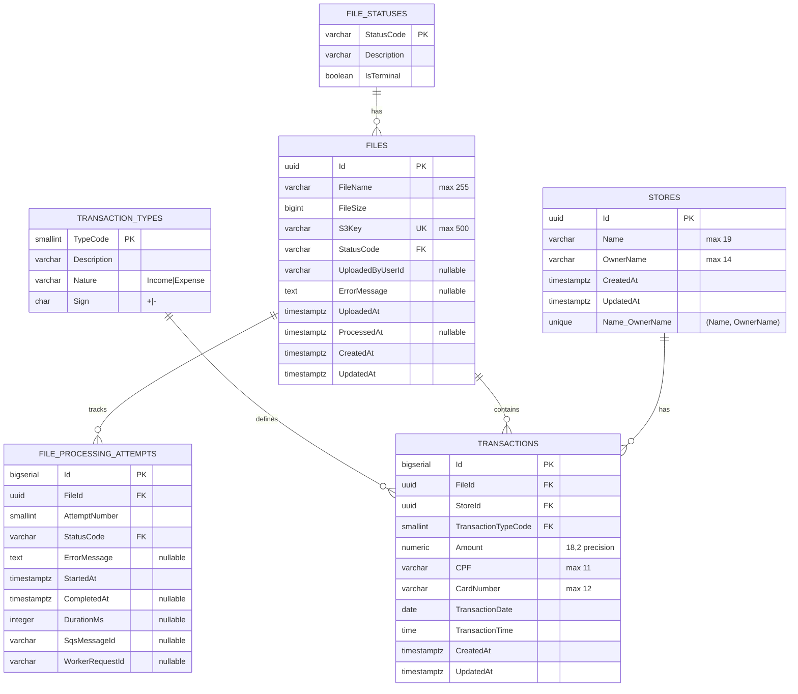

# Database

This document describes the database design, schema, and data persistence strategy.

## Database Choice

### PostgreSQL

PostgreSQL was chosen for:

- **Cloud-native friendliness**: Excellent support on AWS RDS
- **Docker compatibility**: Easy local development setup
- **Strong transactional support**: ACID compliance for file processing
- **Rich feature set**: JSON support, full-text search, extensions
- **Performance**: Excellent query performance and indexing
- **Maturity**: Battle-tested in production environments

## Database Schema

### Design Principles

**Normalization**: Schema follows Third Normal Form (3NF)

- Transaction types normalized to lookup table
- File statuses normalized to lookup table
- No transitive dependencies
- Minimal data redundancy

**Performance**: Optimized for write-heavy workloads

- **UUID v7** for low-write tables (time-ordered, reduces B-tree fragmentation)
- BIGSERIAL for high-write tables (transactions)
- Strategic indexing on query patterns
- Batch insert optimization

**Audit Trail**: Track processing history

- File processing attempts table
- User identification from JWT token
- Timestamp tracking throughout

### UUID v7 Configuration

**Choice**: PostgreSQL UUID v7 (time-ordered, microsecond precision)

**Why UUID v7 over v4**:

- **Time-ordered**: First 48 bits contain timestamp, natural sorting
- **B-tree friendly**: Sequential inserts reduce index fragmentation
- **Performance**: Better INSERT performance vs random UUIDs
- **Observability**: ID timestamp correlates with creation time
- **Still secure**: Random bits (80) provide cryptographic randomness

**PostgreSQL Implementation**:

UUID v7 is available natively in PostgreSQL 13.10+ via `gen_random_uuid()` with proper configuration, or via `pgcrypto` extension for older versions.

```sql
-- For PostgreSQL 13.10+ (native support)
CREATE EXTENSION IF NOT EXISTS pgcrypto;

-- Function to generate UUID v7
CREATE OR REPLACE FUNCTION gen_random_uuid_v7() RETURNS uuid AS $$
DECLARE
    v_time BIGINT;
    v_random BYTEA;
    v_bytes BYTEA;
BEGIN
    -- Get current timestamp in milliseconds
    v_time := (EXTRACT(epoch FROM NOW()) * 1000)::BIGINT;
    -- Generate random bytes (80 bits for randomness)
    v_random := gen_random_bytes(10);
    -- Construct UUID v7: 48-bit timestamp + 4-bit version + 12-bit random + 2-bit variant + 62-bit random
    v_bytes := set_byte(v_random, 6, (get_byte(v_random, 6) & 0x0f) | 0x70);
    v_bytes := set_byte(v_bytes, 8, (get_byte(v_bytes, 8) & 0x3f) | 0x80);
    -- Pack timestamp into first 6 bytes
    v_bytes := set_byte(v_bytes, 0, (v_time >> 40)::int & 0xFF);
    v_bytes := set_byte(v_bytes, 1, (v_time >> 32)::int & 0xFF);
    v_bytes := set_byte(v_bytes, 2, (v_time >> 24)::int & 0xFF);
    v_bytes := set_byte(v_bytes, 3, (v_time >> 16)::int & 0xFF);
    v_bytes := set_byte(v_bytes, 4, (v_time >> 8)::int & 0xFF);
    v_bytes := set_byte(v_bytes, 5, v_time & 0xFF);
    -- Convert to UUID
    RETURN encode(v_bytes, 'hex')::uuid;
END;
$$ LANGUAGE plpgsql;
```

**Alternative (PostgreSQL 13+)**: Use third-party extension

```bash
# Install uuid-ossp or pgvector extension with uuid7 support
CREATE EXTENSION IF NOT EXISTS uuid_ossp;
```

**Usage in Migrations**: Seed function via EF Core migration before applying schema:

```csharp
// In migration
migrationBuilder.Sql(@"
    CREATE OR REPLACE FUNCTION gen_random_uuid_v7() ...
");
```

## Implemented Schema (Target Design)

### Overview

This documentation defines the target, normalized schema to be implemented. It aligns with the CNAB challenge fields and removes persisted calculated values.

### Entity Relationship Diagram



**Relationships**:

- Files → Transactions: One-to-Many, CASCADE delete
- Stores → Transactions: One-to-Many, RESTRICT delete
- TransactionTypes → Transactions: One-to-Many
- FileStatuses → Files: One-to-Many
- Files → FileProcessingAttempts: One-to-Many

**Key Design Decisions**:

- Aggregations (e.g., store totals) are computed from transactions; not persisted.
- Normalize status and type for integrity and auditability.
- Use BIGSERIAL for high-write `Transactions.Id` to reduce B-tree fragmentation.

### Files Table

Stores information about uploaded CNAB files and processing status.

```sql
CREATE TABLE files (
    id UUID PRIMARY KEY,
    file_name VARCHAR(255) NOT NULL,
    file_size BIGINT NOT NULL,
    s3_key VARCHAR(500) NOT NULL UNIQUE,
    status_code VARCHAR(20) NOT NULL REFERENCES file_statuses(status_code),
    uploaded_by_user_id VARCHAR(255),
    error_message TEXT,
    uploaded_at TIMESTAMP WITH TIME ZONE NOT NULL,
    processed_at TIMESTAMP WITH TIME ZONE,
    created_at TIMESTAMP WITH TIME ZONE NOT NULL DEFAULT NOW(),
    updated_at TIMESTAMP WITH TIME ZONE NOT NULL DEFAULT NOW()
);

CREATE INDEX idx_files_status ON files(status_code);
CREATE INDEX idx_files_uploaded_at ON files(uploaded_at);
CREATE INDEX idx_files_uploaded_by ON files(uploaded_by_user_id);
```

### Stores Table

Stores extracted from CNAB transactions. Aggregations are computed on demand.

```sql
CREATE TABLE stores (
    id UUID PRIMARY KEY,
    name VARCHAR(19) NOT NULL,
    owner_name VARCHAR(14) NOT NULL,
    created_at TIMESTAMP WITH TIME ZONE NOT NULL DEFAULT NOW(),
    updated_at TIMESTAMP WITH TIME ZONE NOT NULL DEFAULT NOW(),
    CONSTRAINT stores_name_owner_unique UNIQUE (name, owner_name)
);

CREATE INDEX idx_stores_name ON stores(name);
CREATE INDEX idx_stores_owner_name ON stores(owner_name);
```

### Transactions Table

Stores individual transaction records from CNAB files.

```sql
CREATE TABLE transactions (
    id BIGSERIAL PRIMARY KEY,
    file_id UUID NOT NULL REFERENCES files(id) ON DELETE CASCADE,
    store_id UUID NOT NULL REFERENCES stores(id) ON DELETE RESTRICT,
    transaction_type_code SMALLINT NOT NULL REFERENCES transaction_types(type_code),
    amount DECIMAL(18, 2) NOT NULL,
    cpf VARCHAR(11) NOT NULL,
    card_number VARCHAR(12) NOT NULL,
    transaction_date DATE NOT NULL,
    transaction_time TIME NOT NULL,
    created_at TIMESTAMP WITH TIME ZONE NOT NULL DEFAULT NOW(),
    updated_at TIMESTAMP WITH TIME ZONE NOT NULL DEFAULT NOW(),
    CONSTRAINT transactions_positive_amount CHECK (amount > 0)
);

CREATE INDEX idx_transactions_file_id ON transactions(file_id);
CREATE INDEX idx_transactions_store_id ON transactions(store_id);
CREATE INDEX idx_transactions_date ON transactions(transaction_date);
CREATE INDEX idx_transactions_store_date ON transactions(store_id, transaction_date);
```

### Data Types and Constraints

**Primary Key Strategy**:

- UUID for Files and Stores (distributed uniqueness)
- BIGSERIAL for Transactions (high-write performance)

**Decimal Precision**:

- `NUMERIC(18, 2)` for all monetary values
- 18 total digits, 2 decimal places
- Prevents floating-point precision issues

**Timestamp Strategy**:

- All timestamps stored as `TIMESTAMP WITH TIME ZONE`
- Application layer converts to UTC before storage
- UTC timestamps ensure consistent sorting and comparison
- Client applications handle timezone conversion for display

**String Lengths**:

- `FileName`: 255 characters (standard file name length)
- `Code`: 14 characters (CNAB store code length)
- `Name`: 19 characters (CNAB store name length)
- `CPF`: 11 characters (Brazilian CPF format)
- `Card`: 12 characters (CNAB card number length)
- `ErrorMessage`: 1000 characters (detailed error descriptions)

**Nullability**:

- `ProcessedAt`: Nullable (only set when processing completes)
- `ErrorMessage`: Nullable (only set when errors occur)
- All other fields: NOT NULL (required data)

### Relationships and Referential Integrity

**One-to-Many Relationships**:

1. **Files → Transactions** (Cascade Delete):
   - One file contains many transactions
   - When file is deleted, all related transactions are automatically deleted
   - Ensures data integrity: no orphaned transactions

2. **Stores → Transactions** (Restrict Delete):
   - One store has many transactions
   - Store cannot be deleted if it has transactions
   - Protects historical transaction data

**Foreign Key Enforcement**:

- Database-level constraints ensure referential integrity
- Invalid FileId or StoreId values are rejected
- Transaction isolation prevents race conditions during inserts

### CNAB Transaction Type Reference

Transaction types (lookup table) follow CNAB specifications:

| Type | Description       | Nature  | Sign | Balance Impact |
|------|-------------------|---------|------|----------------|
| 1    | Débito            | Income  | +    | Credit         |
| 2    | Boleto            | Expense | -    | Debit          |
| 3    | Financiamento     | Expense | -    | Debit          |
| 4    | Crédito           | Income  | +    | Credit         |
| 5    | Recebimento Empr. | Income  | +    | Credit         |
| 6    | Vendas            | Income  | +    | Credit         |
| 7    | Recebimento TED   | Income  | +    | Credit         |
| 8    | Recebimento DOC   | Income  | +    | Credit         |
| 9    | Aluguel           | Expense | -    | Debit          |

**Implementation**: Signed amount calculation is derived from `sign` in `transaction_types` and applied in queries/services.

### File Status Reference

Status values are stored in `file_statuses` and referenced by `files.status_code`:

| Status     | Description                              | Terminal | Transitions            |
|------------|------------------------------------------|----------|------------------------|
| Uploaded   | File uploaded, awaiting processing       | No       | → Processing           |
| Processing | File currently being processed           | No       | → Processed, Rejected  |
| Processed  | File successfully processed              | Yes      | (final state)          |
| Rejected   | File rejected due to validation/errors   | Yes      | (final state)          |

**Implementation**: Transitions enforced by application logic and audited in `file_processing_attempts`.

## Data Integrity and Constraints

### Primary Keys

- All tables use UUID (Guid) primary keys
- Generated by application layer via `Guid.NewGuid()`
- Ensures global uniqueness across distributed systems

### Foreign Keys

- **Transactions.FileId → Files.Id**: CASCADE delete behavior
  - Ensures no orphaned transactions when file is deleted
  - Critical for data cleanup and consistency
- **Transactions.StoreId → Stores.Id**: RESTRICT delete behavior
  - Prevents deletion of stores with transaction history
  - Protects historical data integrity

### Unique Constraints

- **Stores.Code**: Business-level unique identifier
  - CNAB store codes must be unique system-wide
  - Supports efficient upsert operations during processing
  - Enforced by unique index `IX_Stores_Code`

### Data Type Constraints

- **Monetary Values**: NUMERIC(18, 2) prevents floating-point errors
- **Timestamps**: All timestamps stored with timezone (UTC)
- **String Lengths**: Match CNAB field specifications (Code: 14, Name: 19, CPF: 11, Card: 12)
- **Nullability**: Only ProcessedAt and ErrorMessage are nullable

### Application-Level Validation

- Transaction type must be 1-9 (enforced by domain entity constructor)
- File status transitions validated by domain methods
- Amount values must be positive (sign determined by type)
- Required fields validated before persistence

### Defense in Depth

- Database constraints provide first line of defense
- Domain entities enforce business rules
- Application services validate complex scenarios
- Both layers work together for data integrity

### Index Optimization Strategy

**Query Performance Indexes**:

1. **File Status Queries** (`IX_Files_Status`):
   - Purpose: Fast filtering of files by processing status
   - Query pattern: `WHERE Status = 'Uploaded'` (pending files)
   - Impact: Supports file processing queue queries

2. **File Upload Timeline** (`IX_Files_UploadedAt`):
   - Purpose: Chronological sorting and date range filtering
   - Query pattern: `ORDER BY UploadedAt DESC` or `WHERE UploadedAt >= @date`
   - Impact: Efficient file history queries

3. **Store Identification** (`stores_name_owner_unique`, UNIQUE):
    - Purpose: Enforce uniqueness by logical store identity (Name + OwnerName)
    - Query pattern: `WHERE name = @name AND owner_name = @owner`
    - Impact: Prevents duplicates without synthetic codes

4. **Store Name Search** (`IX_Stores_Name`):
   - Purpose: Store filtering and searching by name
   - Query pattern: `WHERE Name LIKE @pattern`
   - Impact: Supports store listing and search features

5. **Transaction File Relationship** (`IX_Transactions_FileId`):
   - Purpose: Retrieve all transactions for a specific file
   - Query pattern: `WHERE FileId = @fileId`
   - Impact: File transaction listing and reporting

6. **Transaction Store Relationship** (`IX_Transactions_StoreId`):
   - Purpose: Retrieve all transactions for a specific store
   - Query pattern: `WHERE StoreId = @storeId`
   - Impact: Store transaction history and reporting queries

7. **Transaction Date Filtering** (`IX_Transactions_OccurredAt`):
   - Purpose: Date range queries and chronological sorting
   - Query pattern: `WHERE OccurredAt BETWEEN @start AND @end`
   - Impact: Transaction history and reporting queries

8. **Store-Date Composite** (`IX_Transactions_StoreId_OccurredAt`):
    - Purpose: Optimized store date-range queries
    - Query pattern: `WHERE StoreId = @id AND OccurredAt >= @date`
    - Impact: Most common query pattern for store-centric reports

**Index Coverage**:

- All foreign keys are indexed (FileId, StoreId)
- Frequently filtered columns are indexed (Status, dates)
- Composite index supports most common query pattern
- Unique index enforces business rule (one store per code)

## Entity Framework Core Configuration

### DbContext Implementation

The `ApplicationDbContext` uses Fluent API for entity configuration and relationship mapping.

```csharp
public class ApplicationDbContext : DbContext
{
    public DbSet<File> Files { get; set; }
    public DbSet<Store> Stores { get; set; }
    public DbSet<Transaction> Transactions { get; set; }
    
    public ApplicationDbContext(DbContextOptions<ApplicationDbContext> options)
        : base(options)
    {
    }
    
    protected override void OnModelCreating(ModelBuilder modelBuilder)
    {
        base.OnModelCreating(modelBuilder);
        
        // File entity configuration
        modelBuilder.Entity<File>(entity =>
        {
            entity.HasKey(e => e.Id);
            entity.Property(e => e.FileName).IsRequired().HasMaxLength(255);
            entity.Property(e => e.Status).IsRequired().HasConversion<string>();
            entity.Property(e => e.UploadedAt).IsRequired();
            entity.Property(e => e.ProcessedAt).IsRequired(false);
            entity.Property(e => e.ErrorMessage).HasMaxLength(1000);
            
            entity.HasIndex(e => e.Status);
            entity.HasIndex(e => e.UploadedAt);
        });
        
        // Store entity configuration
        modelBuilder.Entity<Store>(entity =>
        {
            entity.HasKey(e => e.Id);
            entity.Property(e => e.Code).IsRequired().HasMaxLength(14);
            entity.Property(e => e.Name).IsRequired().HasMaxLength(19);
            entity.Property(e => e.CreatedAt).IsRequired();
            entity.Property(e => e.UpdatedAt).IsRequired();
            
            entity.HasIndex(e => e.Code).IsUnique();
            entity.HasIndex(e => e.Name);
        });
        
        // Transaction entity configuration
        modelBuilder.Entity<Transaction>(entity =>
        {
            entity.HasKey(e => e.Id);
            entity.Property(e => e.Type).IsRequired();
            entity.Property(e => e.Amount).IsRequired().HasPrecision(18, 2);
            entity.Property(e => e.OccurredAt).IsRequired();
            entity.Property(e => e.OccurredAtTime).IsRequired();
            entity.Property(e => e.CPF).IsRequired().HasMaxLength(11);
            entity.Property(e => e.Card).IsRequired().HasMaxLength(12);
            entity.Property(e => e.CreatedAt).IsRequired();
            
            // Relationships
            entity.HasOne(e => e.File)
                  .WithMany(f => f.Transactions)
                  .HasForeignKey(e => e.FileId)
                  .OnDelete(DeleteBehavior.Cascade);
            
            entity.HasOne(e => e.Store)
                  .WithMany(s => s.Transactions)
                  .HasForeignKey(e => e.StoreId)
                  .OnDelete(DeleteBehavior.Restrict);
            
            // Indexes
            entity.HasIndex(e => e.FileId);
            entity.HasIndex(e => e.StoreId);
            entity.HasIndex(e => e.OccurredAt);
            entity.HasIndex(e => new { e.StoreId, e.OccurredAt });
        });
    }
    
    public override Task<int> SaveChangesAsync(CancellationToken cancellationToken = default)
    {
        UpdateTimestamps();
        return base.SaveChangesAsync(cancellationToken);
    }
    
    private void UpdateTimestamps()
    {
        var entries = ChangeTracker.Entries()
            .Where(e => e.State == EntityState.Added || e.State == EntityState.Modified);
        
        foreach (var entry in entries)
        {
            if (entry.Entity is Store store)
            {
                if (entry.State == EntityState.Added)
                    store.CreatedAt = DateTime.UtcNow;
                store.UpdatedAt = DateTime.UtcNow;
            }
        }
    }
}
```

### Entity Models

#### File Entity

```csharp
public class File
{
    public Guid Id { get; set; }
    public string FileName { get; set; }
    public FileStatus Status { get; set; }
    public DateTime UploadedAt { get; set; }
    public DateTime? ProcessedAt { get; set; }
    public string? ErrorMessage { get; set; }
    
    // Navigation property
    public ICollection<Transaction> Transactions { get; set; } = new List<Transaction>();
}
```

#### Store Entity

```csharp
public class Store
{
    public Guid Id { get; set; }
    public string Code { get; set; }
    public string Name { get; set; }
    public DateTime CreatedAt { get; set; }
    public DateTime UpdatedAt { get; set; }
    
    // Navigation property
    public ICollection<Transaction> Transactions { get; set; } = new List<Transaction>();
}
```

#### Transaction Entity

```csharp
public class Transaction
{
    public Guid Id { get; set; }
    public Guid FileId { get; set; }
    public Guid StoreId { get; set; }
    public int Type { get; set; }
    public decimal Amount { get; set; }
    public DateTime OccurredAt { get; set; }
    public TimeSpan OccurredAtTime { get; set; }
    public string CPF { get; set; }
    public string Card { get; set; }
    public DateTime CreatedAt { get; set; }
    
    // Navigation properties
    public File File { get; set; }
    public Store Store { get; set; }
    
    /// <summary>
    /// Returns the signed amount based on CNAB transaction type rules.
    /// Types 1,4,5,6,7,8 are credits (positive).
    /// Types 2,3,9 are debits (negative).
    /// </summary>
    public decimal GetSignedAmount()
    {
        return Type switch
        {
            2 or 3 or 9 => -Amount,
            _ => Amount
        };
    }
}
```

## Migrations

### EF Core Migration Strategy

- **Version Control**: All migrations tracked in source control
- **Sequential Naming**: Timestamp-based migration names (yyyyMMddHHmmss_MigrationName)
- **Development**: Migrations applied automatically via `dotnet ef database update`
- **Production**: Migrations applied via CI/CD pipeline before deployment
- **Rollback**: Each migration has Down() method for reverting changes

### Initial Migration (20260117183914_InitialSchema)

The initial migration creates all three core tables with relationships and indexes.

**Created Tables**:

- Files (with Status and UploadedAt indexes)
- Stores (with unique Code index and Name index)
- Transactions (with FileId, StoreId, OccurredAt indexes and composite StoreId+OccurredAt)

**Created Relationships**:

- Transactions.FileId → Files.Id (CASCADE)
- Transactions.StoreId → Stores.Id (RESTRICT)

**Created Indexes**: 8 total indexes for query optimization

### Creating New Migrations

```bash
cd src/backend
dotnet ef migrations add MigrationName \
  --project TransactionProcessor.Infrastructure \
  --startup-project TransactionProcessor.Api \
  --output-dir Persistence/Migrations
```

### Applying Migrations

**Development**:

```bash
dotnet ef database update \
  --project TransactionProcessor.Infrastructure \
  --startup-project TransactionProcessor.Api
```

**Production** (via deployment pipeline):

```bash
dotnet ef database update --connection "<connection-string>"
```

### Migration Best Practices

- Review generated SQL before applying (`dotnet ef migrations script`)
- One logical change per migration
- Test both Up and Down migrations
- Never edit applied migrations
- Backup database before production migrations

## Transaction Processing Strategy

### Atomic File Processing

**Critical Rule**: All transactions from a single CNAB file must be persisted within a single database transaction.

```csharp
using var dbTransaction = await context.Database.BeginTransactionAsync();
try
{
    // 1. Update file status to Processing
    file.Status = FileStatus.Processing;
    await context.SaveChangesAsync();
    
    // 2. Validate all CNAB lines
    var transactions = ValidateAndParseCnabFile(fileContent);
    
    // 3. Upsert stores (bulk operation)
    foreach (var storeCode in transactions.Select(t => t.StoreCode).Distinct())
    {
        await UpsertStoreAsync(storeCode, storeName);
    }
    
    // 4. Insert transactions (bulk operation)
    await context.Transactions.AddRangeAsync(transactions);
    await context.SaveChangesAsync();
    
    // 5. Update store balances
    await RecalculateStoreBalancesAsync(affectedStoreIds);
    
    // 6. Mark file as processed
    file.Status = FileStatus.Processed;
    file.ProcessedAt = DateTime.UtcNow;
    await context.SaveChangesAsync();
    
    // Commit all changes atomically
    await dbTransaction.CommitAsync();
}
catch (Exception ex)
{
    await dbTransaction.RollbackAsync();
    
    // Mark file as rejected
    file.Status = FileStatus.Rejected;
    file.ErrorMessage = ex.Message;
    await context.SaveChangesAsync();
    
    throw;
}
```

### Transaction Boundaries

- **Begin**: When file status changes to Processing
- **Commit**: After all transactions persisted and reports updated
- **Rollback**: On any validation or persistence error

### ACID Guarantees

- **Atomicity**: All transactions from a file succeed or all fail
- **Consistency**: Aggregations derive consistently from transaction history
- **Isolation**: Concurrent file processing doesn't interfere
- **Durability**: Committed data survives system failures

## Query Patterns and Examples

### Store Aggregation Example (computed)

Calculate store balance by summing signed transaction amounts:

```csharp
// Using GetSignedAmount() method
var balance = await context.Transactions
    .AsNoTracking()
    .Where(t => t.StoreId == storeId)
    .SumAsync(t => 
        t.Type == 2 || t.Type == 3 || t.Type == 9 
            ? -t.Amount 
            : t.Amount
    );
```

**SQL Equivalent**:

```sql
SELECT COALESCE(SUM(
    CASE 
        WHEN "Type" IN (2, 3, 9) THEN -"Amount"
        ELSE "Amount"
    END
), 0) AS Balance
FROM "Transactions"
WHERE "StoreId" = @storeId;
```

### Transaction Filtering with Pagination

```csharp
var transactions = await context.Transactions
    .AsNoTracking()
    .Include(t => t.Store)
    .Include(t => t.File)
    .Where(t => 
        (storeId == null || t.StoreId == storeId) &&
        (startDate == null || t.OccurredAt >= startDate) &&
        (endDate == null || t.OccurredAt <= endDate)
    )
    .OrderByDescending(t => t.OccurredAt)
    .Skip((page - 1) * pageSize)
    .Take(pageSize)
    .ToListAsync();
```

### File Processing Status Query

```csharp
var pendingFiles = await context.Files
    .AsNoTracking()
    .Where(f => f.Status == FileStatus.Uploaded)
    .OrderBy(f => f.UploadedAt)
    .ToListAsync();
```

### Store Upsert Pattern

```csharp
var store = await context.Stores
    .FirstOrDefaultAsync(s => s.Code == code);

if (store == null)
{
    store = new Store
    {
        Id = Guid.NewGuid(),
        Code = code,
        Name = name
    };
    context.Stores.Add(store);
}
else
{
    store.Name = name;
}

await context.SaveChangesAsync();
```

## Performance Optimization

### Query Optimization

**Critical for performance - follow these practices:**

1. **Use .AsNoTracking() for Read-Only Queries**:
   - Reduces memory consumption by 30-40%
   - Essential for all list/query endpoints
   - Example: `.AsNoTracking().Include(t => t.Store).ToListAsync()`

2. **Avoid N+1 Queries**:
   - Use `.Include()` for eager loading related entities
   - Never query related entities in loops
   - Example: Load transactions with stores in single query

3. **Use Projections for Read-Only Data**:
   - Select only needed columns with `.Select()`
   - Reduces data transfer and memory usage
   - Example: `.Select(s => new { s.Name, s.OwnerName })`

4. **Batch Operations**:
   - Use `AddRangeAsync()` for multiple inserts
   - Single `SaveChangesAsync()` call per batch
   - Critical for file processing performance

5. **Appropriate Indexes**:
   - Index frequently queried columns (status, dates, foreign keys)
   - Composite indexes for multi-column filters
   - Monitor index usage and effectiveness

**Performance Checklist**:

- ✅ All read-only queries use `.AsNoTracking()`
- ✅ Related entities loaded with `.Include()` (no lazy loading)
- ✅ Projections used to fetch only needed data
- ✅ Batch operations for file processing
- ✅ Indexes on frequently queried columns
- ✅ Query logging enabled for slow query detection

### Monitoring

- Query performance monitoring
- Slow query identification
- Index usage analysis
- Connection pool monitoring

## Security

### Database Security

- Encrypted connections (SSL/TLS)
- Role-based access control
- Least privilege principle
- Parameterized queries (prevent SQL injection)

### Data Protection

- Sensitive data encryption at rest
- PII handling compliance
- Audit logging
- Access logging

### DateTime Storage Standard

**Decision**: All timestamps stored as UTC in PostgreSQL

- **Column Type**: `timestamp with time zone`
- **Storage Format**: UTC timezone
- **Application Layer**: Convert to UTC before storing
- **Retrieval**: Return as UTC, client handles timezone conversion

**EF Core Configuration**:

```csharp
entity.Property(e => e.CreatedAt)
    .HasColumnType("timestamp with time zone")
    .HasDefaultValueSql("NOW()");
```

**Benefits**:

- No timezone ambiguity
- Consistent sorting and comparison
- Easy conversion to local times in client
- Standard practice for distributed systems

## Connection Management

### EF Core Connection Pooling

Entity Framework Core automatically manages connection pooling with configurable settings:

```csharp
// Program.cs configuration
builder.Services.AddDbContext<ApplicationDbContext>(options =>
    options.UseNpgsql(connectionString, npgsqlOptions =>
    {
        npgsqlOptions.CommandTimeout(30);
        npgsqlOptions.EnableRetryOnFailure(
            maxRetryCount: 3,
            maxRetryDelay: TimeSpan.FromSeconds(5),
            errorCodesToAdd: null);
    }));
```

**Connection Pool Settings**:

- Default pool size: 100 connections (configurable via connection string)
- Connection timeout: 30 seconds
- Idle connection cleanup: Automatic
- Retry on transient failures: 3 attempts with exponential backoff

### Best Practices

- ✅ Use async methods throughout (`*Async()`)
- ✅ Dispose DbContext properly (automatic with DI scopes)
- ✅ Keep transactions short-lived
- ✅ Use `AsNoTracking()` for read-only queries
- ✅ Monitor connection pool exhaustion
- ❌ Don't share DbContext across requests
- ❌ Avoid long-running transactions (>5 seconds)
- ❌ Never block async methods with `.Result` or `.Wait()`

## Backup and Recovery

### Local Development

**Docker Volume Backup**:

```bash
# Backup postgres-data volume
docker run --rm -v postgres-data:/data -v $(pwd):/backup ubuntu tar czf /backup/postgres-backup.tar.gz /data

# Restore from backup
docker run --rm -v postgres-data:/data -v $(pwd):/backup ubuntu tar xzf /backup/postgres-backup.tar.gz -C /
```

### Production (AWS RDS)

**Automated Backups**:

- Retention period: 7-30 days (configurable)
- Backup window: During low-traffic hours
- Point-in-time recovery: Up to 5 minutes before failure
- Multi-AZ deployment: Automatic failover

**Manual Snapshots**:

- Create before major migrations
- Long-term retention (beyond automated window)
- Cross-region replication for disaster recovery

### Recovery Procedures

1. **Identify failure point**: Check CloudWatch logs and metrics
2. **Assess data loss**: Determine last successful transaction
3. **Choose recovery method**: Point-in-time restore vs snapshot
4. **Restore database**: Via AWS Console or CLI
5. **Verify integrity**: Run validation queries
6. **Resume operations**: Update connection strings, restart services

**Recovery Objectives**:

- **RTO** (Recovery Time Objective): < 1 hour
- **RPO** (Recovery Point Objective): < 5 minutes

## Local Development Configuration

### Docker Compose Setup

PostgreSQL 16 runs in Docker for local development:

```yaml
services:
  postgres:
    image: postgres:16
    environment:
      POSTGRES_DB: transactionprocessor
      POSTGRES_USER: postgres
      POSTGRES_PASSWORD: postgres
    ports:
      - "5432:5432"
    volumes:
      - postgres-data:/var/lib/postgresql/data
    healthcheck:
      test: ["CMD-SHELL", "pg_isready -U postgres"]
      interval: 10s
      timeout: 5s
      retries: 5

volumes:
  postgres-data:
```

### Connection String

**Development** (appsettings.Development.json):

```json
{
  "ConnectionStrings": {
    "DefaultConnection": "Host=localhost;Port=5432;Database=transactionprocessor;Username=postgres;Password=postgres;Ssl Mode=Disable"
  }
}
```

**Production** (AWS RDS):

```json
{
  "ConnectionStrings": {
    "DefaultConnection": "Host=<rds-endpoint>;Port=5432;Database=transactionprocessor;Username=<user>;Password=<password>;Ssl Mode=Require"
  }
}
```

### Applying Schema Locally

1. Start PostgreSQL:

   ```bash
   docker-compose up -d postgres
   ```

2. Apply migrations:

   ```bash
   cd src/backend
   dotnet ef database update \
     --project TransactionProcessor.Infrastructure \
     --startup-project TransactionProcessor.Api
   ```

3. Verify schema:

   ```bash
   docker exec -it <container-id> psql -U postgres -d transactionprocessor
   \dt  -- List tables
   \d "Files"  -- Describe Files table
   ```

## Production Considerations

### AWS RDS

- Managed PostgreSQL service
- Automated backups
- Multi-AZ for high availability
- Read replicas for scaling
- Monitoring and alerting

### Migration to Production

- Test migrations in staging
- Backup before migration
- Monitor during migration
- Rollback plan ready
