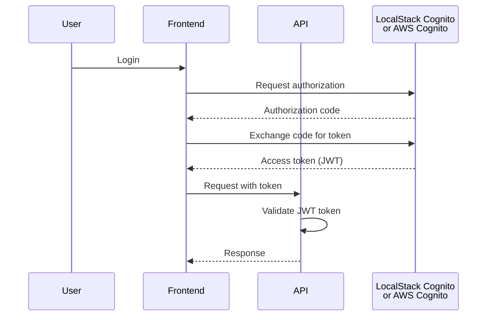

# Security

This document describes the security implementation, considerations, and production-grade alternatives.

## Overview

Security is a critical aspect of the system. This document outlines the security measures implemented and explicitly documents simplifications made for test/demo purposes.

## Authentication

### OAuth2 Implementation

The system uses OAuth2 for authentication:

- **Token-based**: JWT tokens for API access
- **Authorization Server**: LocalStack Cognito (local) / AWS Cognito (production)
- **Token Format**: JWT (JSON Web Tokens)
- **Token Validation**: Comprehensive JWT validation including signature, expiration, issuer, audience

### Authorization Server

#### Local Development (LocalStack)

- **LocalStack Cognito**: Emulated AWS Cognito service for local development
- **Purpose**: Allows testing OAuth2 flows without AWS account
- **Configuration**: Docker Compose includes LocalStack with Cognito service
- **Token Issuance**: LocalStack Cognito issues JWT tokens compatible with AWS Cognito format
- **Endpoint**: `http://localhost:4566` (LocalStack default)
- **Limitations**: Simplified for local development, not production-grade

#### Production

- **AWS Cognito**: Managed OAuth2/OIDC provider
- **User Pools**: Managed user directory
- **Token Issuance**: Production-grade JWT tokens
- **Integration**: Native AWS service integration

### Authentication Flow



### Token Validation

#### Basic Validation

- **JWT Signature Verification**: Validate signature using issuer's public key
- **Token Expiration**: Check `exp` claim against current time
- **Issuer Validation**: Verify `iss` claim matches expected issuer
- **Audience Validation**: Verify `aud` claim matches expected audience
- **Issued At**: Validate `iat` claim (token not used before issued)

#### Comprehensive JWT Validation Checklist

Every JWT token must be validated for:

1. **Signature Verification**
   - ✅ Valid signature using issuer's public key
   - ✅ Algorithm matches expected (RS256)
   - ✅ Public key fetched from issuer's JWKS endpoint

2. **Algorithm Security**
   - ✅ Reject tokens with `alg: none`
   - ✅ Reject tokens with unexpected algorithms
   - ✅ Use RS256 (RSA with SHA-256) for public APIs
   - ✅ Prevent algorithm confusion attacks

3. **Claims Validation**
   - ✅ `exp` (expiration): Token not expired
   - ✅ `iat` (issued at): Token not used before issued
   - ✅ `iss` (issuer): Valid issuer (LocalStack Cognito or AWS Cognito)
   - ✅ `aud` (audience): Valid audience (API identifier)
   - ✅ `nbf` (not before): Token valid for use (if present)
   - ✅ `sub` (subject): User identifier present

4. **Clock Skew**
   - ✅ Account for reasonable clock skew (5 minutes default)
   - ✅ Validate expiration with clock skew tolerance

5. **Token Structure**
   - ✅ Valid JWT format (header.payload.signature)
   - ✅ Base64URL encoding correct
   - ✅ Required claims present

## Authorization

### Role-Based Access Control (RBAC)

- **Roles**: Admin, User (if applicable)
- **Policies**: Based on roles
- **Resource Access**: Controlled by policies

### API Authorization

- Protected endpoints require valid token
- Role-based endpoint access
- Resource-level authorization

## Input Validation

### Validation Layers

1. **Frontend Validation**: UX improvement (not security)
2. **API Validation**: Request validation (FastEndpoints validators)
3. **Domain Validation**: Business rule validation
4. **Database Constraints**: Data integrity

### Validation Rules

- File type validation
- File size limits
- Input sanitization
- SQL injection prevention (parameterized queries)
- XSS prevention (output encoding)

## Data Protection

### Encryption at Rest

- **Database**: Encrypted storage (AWS RDS encryption)
- **S3**: Server-side encryption (SSE)
- **Secrets**: Encrypted in AWS Secrets Manager

### Encryption in Transit

- **HTTPS**: TLS 1.2+ for all API communication
- **Database**: SSL/TLS for database connections
- **S3**: HTTPS for S3 access

### Sensitive Data

- **CPF**: Considered PII, handle with care
- **Card Numbers**: Masked in logs and responses
- **File Contents**: Stored securely in S3

## File Security

### S3 Bucket Security

- **Bucket Policy**: Restrict access to Lambda only
- **Encryption**: Server-side encryption enabled
- **Versioning**: Enabled for recovery
- **Lifecycle**: Archive or delete old files

### File Access Control

- Files accessible only by Lambda function
- No public access
- Signed URLs for temporary access (if needed)

## API Security

### HTTPS Enforcement

- All API endpoints require HTTPS
- HTTP redirects to HTTPS
- HSTS headers

### CORS Configuration

- Restricted origins
- Allowed methods: GET, POST
- Allowed headers: Authorization, Content-Type
- Credentials: Include cookies if needed

### Rate Limiting

- API rate limiting (if implemented)
- Per-user limits
- Per-IP limits
- Protection against abuse

## Database Security

### Connection Security

- Encrypted connections (SSL/TLS)
- Connection string encryption
- Credentials in environment variables or secrets

### Access Control

- Least privilege principle
- Separate users for different operations
- Read-only users for queries
- Write users for mutations

### SQL Injection Prevention

- Parameterized queries (EF Core)
- No string concatenation in SQL
- Input validation
- ORM protection

## Secrets Management

### Configuration-First Principle

- All sensitive values come from Secrets Manager (prod) or LocalStack Secrets Manager (dev)
- Non-sensitive configuration prefers Parameter Store or environment variables
- appsettings.{Environment}.json holds defaults; overrides happen via env vars/secret resolution
- No hardcoded credentials, connection strings, or endpoints in code
- Startup validation fails fast if required secrets/config keys are missing

### AWS Secrets Manager

#### Overview

AWS Secrets Manager is used to securely store, manage, and retrieve sensitive information such as:
- Database connection strings
- API keys
- OAuth client secrets
- Third-party service credentials
- Encryption keys

#### Local Development (LocalStack)

- **LocalStack Secrets Manager**: Emulated AWS Secrets Manager for local development
- **Configuration**: Docker Compose includes LocalStack with Secrets Manager service
- **Secret Storage**: Secrets stored in LocalStack's in-memory/persisted storage
- **Access**: Accessed via AWS SDK with LocalStack endpoint configuration
- **Purpose**: Allows testing secrets management flows without AWS account
- **Endpoint**: `http://localhost:4566` (LocalStack default)

#### Production

- **AWS Secrets Manager**: Managed service for secrets lifecycle management
- **Encryption**: Automatic encryption at rest using AWS KMS
- **Rotation**: Automatic secret rotation support
- **Access Control**: IAM-based access policies
- **Audit**: CloudTrail integration for access logging
- **High Availability**: Multi-AZ replication
- **Versioning**: Secret versions maintained for rollback capability

#### Implementation Details

**Secret Retrieval Pattern**:
```csharp
// Secrets retrieved at application startup
// Cached in memory for performance
// Automatic refresh on secret rotation (production)
var client = new AmazonSecretsManagerClient();
var request = new GetSecretValueRequest
{
    SecretId = "TransactionProcessor/Database/ConnectionString"
};
var response = await client.GetSecretValueAsync(request);
var connectionString = response.SecretString;
```

**Secrets Stored**:
- `TransactionProcessor/Database/ConnectionString` - PostgreSQL connection string
- `TransactionProcessor/AWS/S3/BucketName` - S3 bucket configuration
- `TransactionProcessor/AWS/SQS/QueueUrl` - SQS queue URLs
- `TransactionProcessor/OAuth/ClientSecret` - OAuth client secret (production only)
- `TransactionProcessor/JWT/SigningKey` - JWT signing key (if applicable)

**Access Pattern**:
- Lambda functions granted IAM permissions to read specific secrets
- Principle of least privilege enforced
- Secrets scoped by environment (dev/staging/prod)
- Each service only has access to required secrets

#### Security Benefits

1. **No Hardcoded Credentials**: All sensitive data externalized from code
2. **Centralized Management**: Single source of truth for secrets
3. **Audit Trail**: All secret access logged and monitored via CloudTrail
4. **Automatic Rotation**: Database passwords rotated without application downtime
5. **Encryption**: Secrets encrypted at rest (KMS) and in transit (TLS)
6. **Version Control**: Secret versions maintained for emergency rollback
7. **Fine-grained Access**: IAM policies control who/what can access secrets
8. **Compliance**: Helps meet compliance requirements (SOC, PCI DSS, etc.)

#### Best Practices

- **Naming Convention**: Use hierarchical naming (`<App>/<Component>/<Secret>`)
- **Tagging**: Tag secrets with environment, owner, and purpose
- **Rotation**: Enable automatic rotation for database credentials
- **Monitoring**: Set up CloudWatch alarms for unauthorized access attempts
- **Documentation**: Document all secrets in a secure secrets catalog
- **Least Privilege**: Grant minimal IAM permissions required

#### Trade-offs

**Local Development**:
- LocalStack Secrets Manager used for consistency with production
- Some advanced features (automatic rotation) simplified in local environment
- Secrets can be pre-seeded via init scripts for convenience
- No cost for local development and testing

**Production**:
- Cold start latency consideration (secret retrieval on Lambda init)
- Mitigated by caching secrets in Lambda execution context
- Cost considerations for secret retrieval API calls (~$0.05 per 10,000 calls)
- Secrets Manager costs ~$0.40 per secret per month

### Development

- **appsettings.json**: Local configuration (not committed)
- **Environment Variables**: Local development
- **Docker Secrets**: For Docker Compose
- **LocalStack Secrets Manager**: Emulated for testing

### Production

- **AWS Secrets Manager**: Managed secrets service (primary)
- **Parameter Store**: Configuration parameters (non-sensitive)
- **No Hardcoded Secrets**: Never commit secrets to version control

### Secret Rotation

- Regular secret rotation (30-90 days recommended)
- Automated rotation (AWS Secrets Manager supports Lambda-based rotation)
- No long-lived credentials
- Zero-downtime rotation strategy

## Logging and Monitoring

### Security Logging

- Authentication attempts
- Authorization failures
- File access logs
- API access logs
- Error logs (without sensitive data)

### Log Protection

- No sensitive data in logs
- Masked credentials
- Masked PII
- Secure log storage

### Monitoring

- Failed authentication attempts
- Unusual access patterns
- Error rate monitoring
- Security event alerts

## Security Headers

### HTTP Security Headers

- **X-Content-Type-Options**: nosniff
- **X-Frame-Options**: DENY
- **X-XSS-Protection**: 1; mode=block
- **Strict-Transport-Security**: max-age=31536000
- **Content-Security-Policy**: Restrictive policy

## Explicit Simplifications (Test/Demo Only)

### ⚠️ Important: Test/Demo Simplifications

For test and demonstration purposes, the following simplifications have been made:

1. **OAuth2 Credentials**
   - Credentials may be exposed in configuration files
   - **Production**: Use AWS Secrets Manager or Parameter Store
   - **Production**: Implement credential rotation

2. **Token Validation**
   - Simplified token validation for demo
   - **Production**: Full OAuth2 flow with proper validation
   - **Production**: Token refresh mechanism

3. **HTTPS**
   - Local development may use HTTP
   - **Production**: Enforce HTTPS everywhere
   - **Production**: Valid SSL certificates

4. **CORS**
   - Permissive CORS for local development
   - **Production**: Restrictive CORS policy
   - **Production**: Specific allowed origins

5. **Rate Limiting**
   - May not be implemented in demo
   - **Production**: Implement rate limiting
   - **Production**: DDoS protection

6. **Secrets**
   - Secrets in configuration files
   - **Production**: Use secrets management service
   - **Production**: No secrets in code or config files

### Production-Grade Alternatives

#### Authentication

- **AWS Cognito**: Managed authentication service
- **Auth0**: Enterprise authentication platform
- **Okta**: Identity and access management

#### Secrets Management

- **AWS Secrets Manager**: Managed secrets service
- **HashiCorp Vault**: Secrets management platform
- **Azure Key Vault**: Cloud secrets management

#### API Security

- **AWS API Gateway**: Managed API service with built-in security
- **AWS WAF**: Web application firewall
- **CloudFlare**: DDoS protection and security

#### Monitoring

- **AWS CloudWatch**: Logging and monitoring
- **AWS GuardDuty**: Threat detection
- **AWS Security Hub**: Security posture management

## Security Best Practices

### Development

1. **Never commit secrets**
2. **Use environment variables**
3. **Validate all inputs**
4. **Use parameterized queries**
5. **Keep dependencies updated**
6. **Review security advisories**

### Production

1. **Encrypt everything**
2. **Use managed services**
3. **Implement least privilege**
4. **Monitor security events**
5. **Regular security audits**
6. **Incident response plan**

## Compliance Considerations

### Data Privacy

- **GDPR**: If handling EU data
- **LGPD**: If handling Brazilian data
- **PII Handling**: Proper handling of personal information

### Data Retention

- **File Retention**: Policy for file retention
- **Log Retention**: Policy for log retention
- **Transaction Retention**: Policy for transaction data

## Security Checklist

### Pre-Deployment

- [ ] All secrets in secrets management
- [ ] HTTPS enforced
- [ ] CORS configured correctly
- [ ] Input validation implemented
- [ ] SQL injection prevention
- [ ] XSS prevention
- [ ] Security headers configured
- [ ] Logging configured (no sensitive data)
- [ ] Monitoring configured
- [ ] Backup and recovery tested

### Ongoing

- [ ] Regular security updates
- [ ] Dependency updates
- [ ] Security monitoring
- [ ] Access review
- [ ] Secret rotation
- [ ] Security audits

## Incident Response

### Security Incident Plan

1. **Detection**: Monitor for security events
2. **Response**: Immediate response to incidents
3. **Containment**: Contain the incident
4. **Recovery**: Restore normal operations
5. **Post-Incident**: Review and improve

### Contact Information

- Security team contact
- Escalation procedures
- External security contacts

## OWASP Top 10 Compliance

### A01:2021 – Broken Access Control

**Mitigations**:
- Token validation on every request
- Role-based access control (RBAC)
- Resource-level authorization checks
- Principle of least privilege

**Implementation**:
- Validate JWT token on every protected endpoint
- Check user roles/permissions from token claims
- Verify resource ownership before operations

### A02:2021 – Cryptographic Failures

**Mitigations**:
- Strong signing algorithms (RS256, not HS256 for public APIs)
- Token encryption in transit (HTTPS/TLS)
- Secure token storage (HttpOnly cookies when applicable)
- No sensitive data in token payload

**Implementation**:
- Use RS256 for JWT signing
- Enforce HTTPS for all API communication
- Store tokens securely (not in localStorage for sensitive apps)
- Mask tokens in logs and error messages

### A03:2021 – Injection

**Mitigations**:
- Parameterized queries (EF Core)
- Input validation and sanitization
- No token data in SQL queries
- ORM protection

**Implementation**:
- EF Core uses parameterized queries by default
- Validate and sanitize all inputs
- Never use token claims directly in SQL

### A07:2021 – Identification and Authentication Failures

**Mitigations**:
- Token expiration enforcement
- Token refresh mechanism
- Secure token storage
- Protection against token replay attacks
- Multi-factor authentication (if applicable)

**Implementation**:
- Short-lived access tokens (15-60 minutes)
- Refresh token mechanism
- Secure token storage
- Token revocation support (for critical operations)

## JWT-Specific Vulnerabilities

### Known JWT Vulnerabilities and Mitigations

#### 1. Algorithm Confusion (CVE-2015-9235)

**Vulnerability**: Attacker can forge tokens by changing algorithm to `none` or using a different algorithm.

**Mitigation**:
- Explicitly validate algorithm in token header
- Reject tokens with `alg: none`
- Reject tokens with unexpected algorithms
- Always verify signature, never trust unsigned tokens

**Implementation**:
```csharp
// Always validate algorithm
if (token.Header.Alg != "RS256")
{
    throw new SecurityException("Invalid algorithm");
}
```

#### 2. Weak Signing Algorithms

**Vulnerability**: Using HS256 (symmetric) in public API scenarios allows token forgery if secret is compromised.

**Mitigation**:
- Use RS256 (RSA with SHA-256) for public APIs
- Validate algorithm matches expected value
- Reject tokens signed with weak algorithms

**Implementation**:
- Configure JWT validation to only accept RS256
- Fetch public key from issuer's JWKS endpoint
- Never use shared secrets for public APIs

#### 3. Token Expiration Bypass

**Vulnerability**: Tokens used after expiration if validation is not enforced.

**Mitigation**:
- Always validate `exp` claim
- Check expiration on every request
- Account for reasonable clock skew (5 minutes default)

**Implementation**:
```csharp
// Validate expiration with clock skew
var clockSkew = TimeSpan.FromMinutes(5);
if (token.ValidTo < DateTime.UtcNow.Add(-clockSkew))
{
    throw new SecurityException("Token expired");
}
```

#### 4. Token Replay Attacks

**Vulnerability**: Expired tokens can be reused if not properly invalidated.

**Mitigation**:
- Short-lived access tokens (15-60 minutes)
- Token refresh mechanism
- Token revocation list for critical operations

**Implementation**:
- Set short expiration times for access tokens
- Implement refresh token flow
- Maintain revocation list (Redis/database) for critical operations

#### 5. Insecure Token Storage

**Vulnerability**: Tokens stored in localStorage can be accessed by XSS attacks.

**Mitigation**:
- Use HttpOnly cookies when possible
- Secure memory storage for sensitive apps
- Never log tokens
- Mask tokens in error messages

**Implementation**:
- Prefer HttpOnly cookies for web applications
- Use secure memory storage for mobile apps
- Never include tokens in logs or error responses

#### 6. Missing Signature Verification

**Vulnerability**: Tokens accepted without signature verification.

**Mitigation**:
- Always verify token signature
- Validate signature against public key from issuer
- Reject unsigned or improperly signed tokens

**Implementation**:
- Fetch public key from issuer's JWKS endpoint
- Verify signature on every request
- Reject tokens with invalid signatures

#### 7. Insufficient Claims Validation

**Vulnerability**: Tokens accepted with missing or invalid claims.

**Mitigation**:
- Validate all required claims (`iss`, `aud`, `exp`, `iat`, `sub`)
- Custom claim validation for business logic
- Reject tokens with missing or invalid claims

**Implementation**:
```csharp
// Validate all required claims
if (string.IsNullOrEmpty(token.Issuer) ||
    string.IsNullOrEmpty(token.Audience) ||
    string.IsNullOrEmpty(token.Subject))
{
    throw new SecurityException("Missing required claims");
}
```

## Security Headers

### HTTP Security Headers

- **X-Content-Type-Options**: nosniff
- **X-Frame-Options**: DENY
- **X-XSS-Protection**: 1; mode=block
- **Strict-Transport-Security**: max-age=31536000
- **Content-Security-Policy**: Restrictive policy

## References

- [OWASP Top 10](https://owasp.org/www-project-top-ten/)
- [OWASP JWT Cheat Sheet](https://cheatsheetseries.owasp.org/cheatsheets/JSON_Web_Token_for_Java_Cheat_Sheet.html)
- [JWT Best Practices](https://datatracker.ietf.org/doc/html/rfc8725)
- [AWS Cognito Security Best Practices](https://docs.aws.amazon.com/cognito/latest/developerguide/security-best-practices.html)
- [AWS Security Best Practices](https://aws.amazon.com/security/security-resources/)
- [.NET Security Guidelines](https://learn.microsoft.com/en-us/dotnet/standard/security/)
- [React Security Best Practices](https://reactjs.org/docs/security.html)
